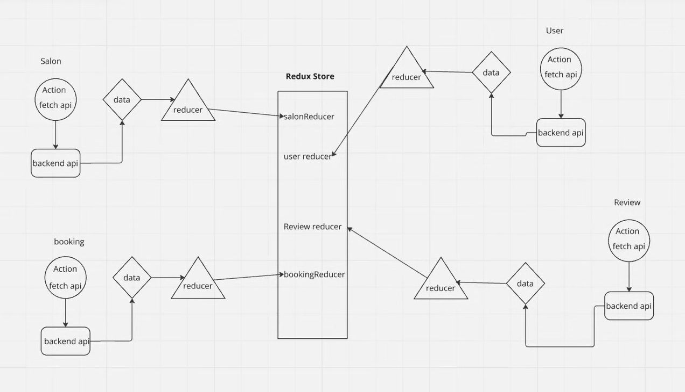
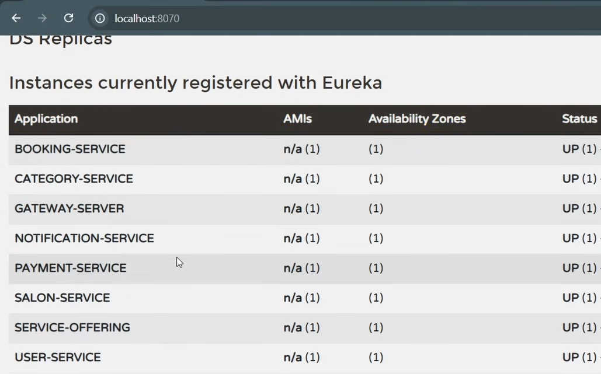
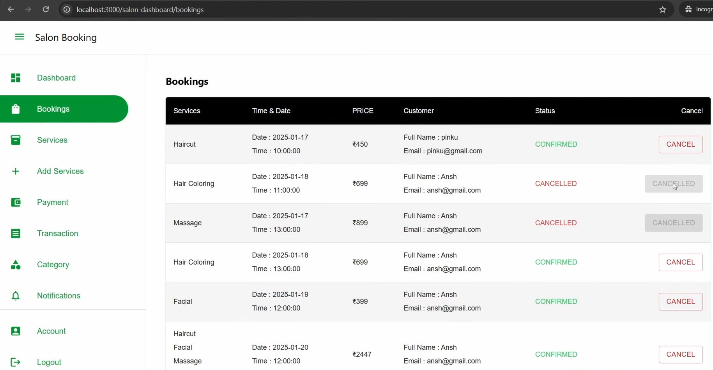
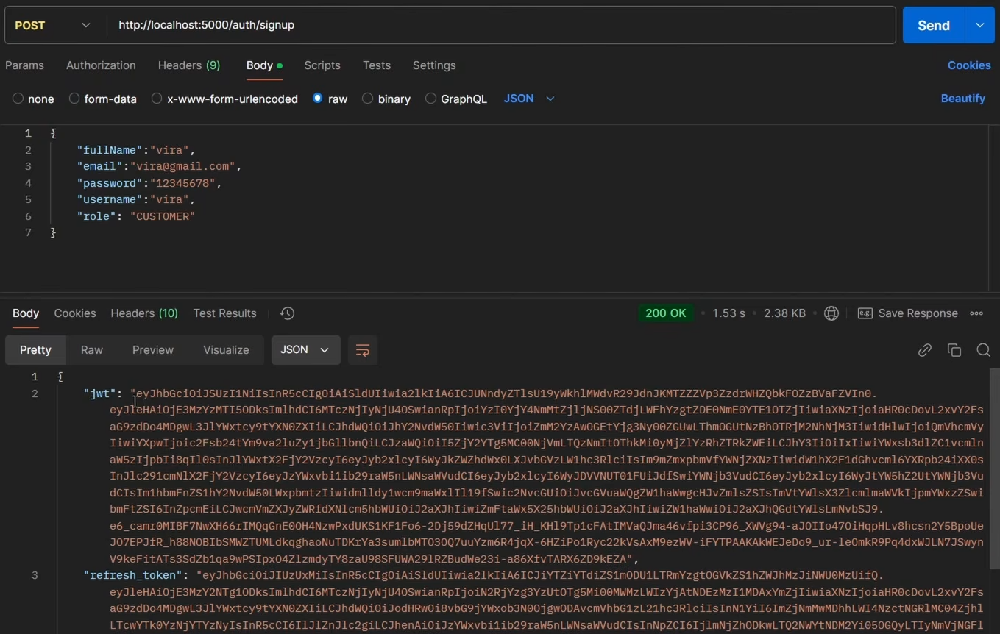
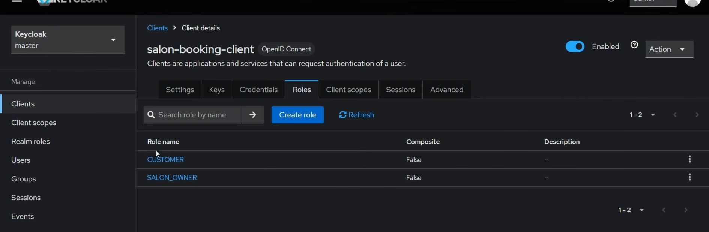
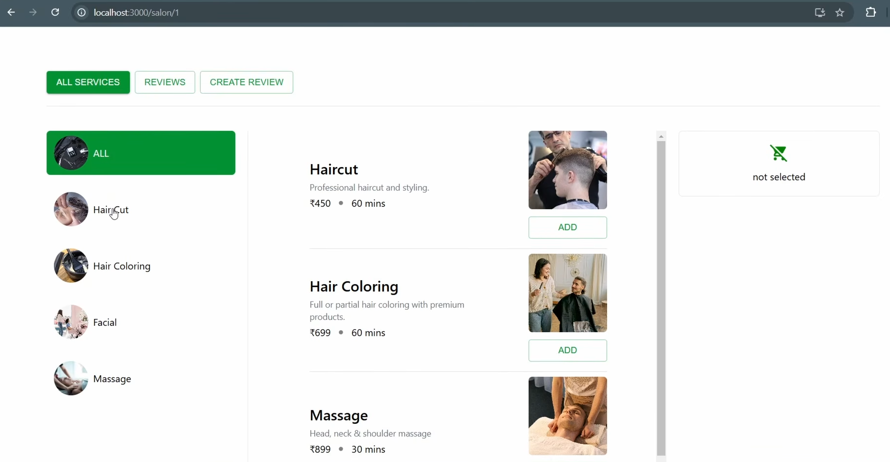
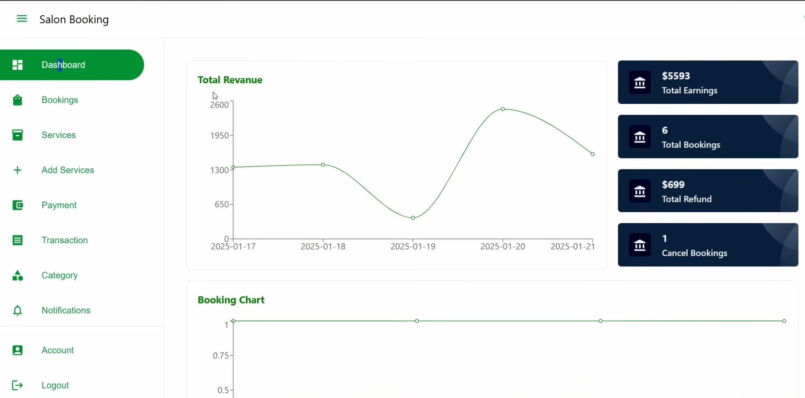
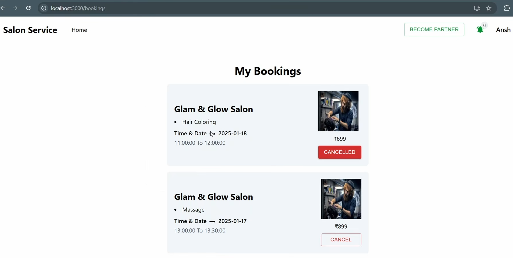
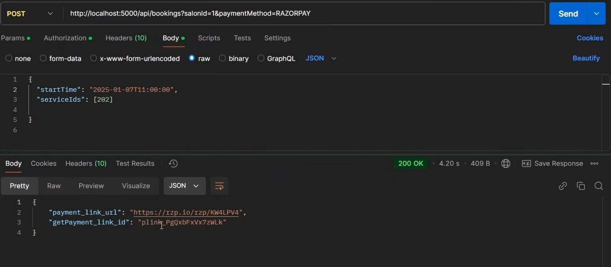

# BookMySalon – Full-Stack Microservices Project

<div align="center">



[](#-skills-demonstrated-in-this-project)
[](#-skills-demonstrated-in-this-project)
[](#-core-architecture-used)
[](#-core-architecture-used)
[](#-core-architecture-used)

</div>

BookMySalon is a full-stack salon booking platform built to demonstrate production-style backend architecture with microservices and a modern frontend application.

This project highlights my ability to design and implement distributed systems using Spring Boot, secure APIs, event-driven communication, and frontend integration.

---

## 📌 Table of Contents

- [🚀 Project Overview](#-project-overview)
- [🧠 Skills Demonstrated in This Project](#-skills-demonstrated-in-this-project)
- [🏗️ Microservices in This Repository](#️-microservices-in-this-repository)
- [⚙️ Core Architecture Used](#️-core-architecture-used)
- [🖼️ Architecture & Product Preview](#️-architecture--product-preview)
- [📂 Project Structure](#-project-structure)
- [✅ What This Project Communicates to Recruiters / HR](#-what-this-project-communicates-to-recruiters--hr)
- [👨‍💻 Author Note](#-author-note)

---

## 🚀 Project Overview

BookMySalon enables users to discover salons, book services, manage appointments, make payments, and review salons through role-based workflows (customer, salon partner, admin).

I built this project using a **microservices architecture** where each service has clear responsibility and communicates through REST and messaging patterns.

---

## 🧠 Skills Demonstrated in This Project

### Backend (Spring Boot Microservices)
- Designed and developed multiple Spring Boot microservices with clear domain boundaries.
- Implemented service registration and discovery using **Eureka Server**.
- Built centralized routing and filtering using an **API Gateway**.
- Enabled inter-service synchronous communication using **OpenFeign** clients.
- Implemented asynchronous event communication with **RabbitMQ**.
- Integrated **MySQL** for persistent data storage.
- Applied secure authentication/authorization flow using **Keycloak** (security integration).
- Used layered architecture patterns (`controller -> service -> repository`) with DTO mapping.

### Frontend
- Built a React-based frontend for customer, salon, and admin workflows.
- Integrated API communication with backend services.
- Implemented dashboard, booking, review, category, payment, and authentication related screens.

### Engineering & Deployment
- Dockerized backend services.
- Added Docker Compose setup for local orchestration.
- Organized codebase for scalability and maintainability.

---

## 🏗️ Microservices in This Repository

The backend contains multiple microservices, including:
- `user-service`
- `salon`
- `category`
- `booking-service`
- `payment`
- `notification`
- `gateway-server`
- `eurekaserver`

Each service is independently structured with its own configuration, controller, service, and persistence layers.

---

## ⚙️ Core Architecture Used

- **Service Registry & Discovery:** Eureka Server
- **Single Entry Point:** API Gateway
- **Synchronous Service Calls:** OpenFeign
- **Asynchronous/Event Communication:** RabbitMQ
- **Security:** Keycloak
- **Database:** MySQL
- **Frontend:** React
- **Containerization:** Docker + Docker Compose

---

## 🖼️ Architecture & Product Preview

### System Design & Infra

| Architecture | Eureka Dashboard | Booking API |
|---|---|---|
|  |  |  |

### Authentication & Access

| User Login | Keycloak Login |
|---|---|
|  |  |

### Core Product Experience

| Salon Discovery | Booking Flow | Frontend Booking |
|---|---|---|
|  |  |  |

### Payments



---

## 📂 Project Structure

```text
BookMySalon/
├── backend (microservices)/
│   ├── user-service/
│   ├── salon/
│   ├── category/
│   ├── booking-service/
│   ├── payment/
│   ├── notification/
│   ├── gateway-server/
│   ├── eurekaserver/
│   └── docker-compose/
├── images/
└── frontend/
```

---

## ✅ What This Project Communicates to Recruiters / HR

This repository demonstrates that I can:
- Build and integrate a complete full-stack application.
- Work with distributed microservice systems, not only monolithic apps.
- Design scalable backend communication patterns (REST + events).
- Implement real-world infrastructure components (gateway, registry, messaging broker).
- Build secure API architecture using modern identity management.
- Structure code for maintainability and team collaboration.

---

## 👨‍💻 Author Note

This project is intentionally built as an end-to-end learning + production-style portfolio implementation to reflect my practical backend and full-stack engineering capability.

If you are reviewing this project for hiring, you can evaluate my:
- System design understanding
- Backend engineering depth (Spring ecosystem)
- API design and integration ability
- Microservices communication strategies
- Full-stack delivery skills
